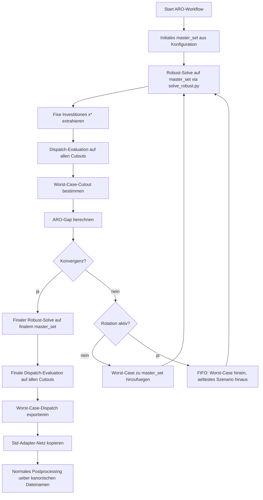

# Review der ARO-/Robust-Implementierung

## Zweck dieses Dokuments

Dieses Dokument beschreibt die Implementierung in [`scripts/solve_aro.py`](../scripts/solve_aro.py) und [`scripts/solve_robust.py`](../scripts/solve_robust.py).

Es beantwortet drei Fragen:

1. Ist die Implementierung methodisch wirklich ARO?
2. Welche Auffaelligkeiten und Inkonsistenzen gibt es im aktuellen Projekt?
3. Wie lauten die Modellgleichungen in mathematischer Form?

Die ausfuehrliche Symbolik steht in [`notation.md`](./notation.md).

## Kurzfazit

- Der eigentliche robuste Master steckt in [`scripts/solve_robust.py`](../scripts/solve_robust.py), Funktion `solve_aro_master` ab etwa Zeile 3497.
- [`scripts/solve_aro.py`](../scripts/solve_aro.py) ist ein aeusserer Iterations- und Szenarioauswahl-Loop, `main()` ab etwa Zeile 590.
- Ohne Rotation (`max_master_size = 0`) ist das ein diskretes zweistufiges robustes Optimierungsverfahren mit szenarioabhaengigem Recourse.
- Mit Rotation (`max_master_size > 0`) ist es keine exakte ARO-Garantie mehr, sondern eine Rolling-Window-Heuristik. Das sagt die Datei selbst explizit im Docstring ab etwa Zeile 61.

## Architektur

### Ebene 1: Workflow

- Der Workflow-Modus wird in [`config/config.yaml`](../config/config.yaml) mit `workflow.mode: "aro"` aktiviert, etwa Zeile 42.
- Im [`Snakefile`](../Snakefile) werden sowohl `rules/solve_robust.smk` als auch `rules/solve_aro.smk` eingebunden, etwa Zeilen 95 bis 96.
- Im ARO-Modus priorisiert der Workflow die Adapter-Regel `aro_as_canonical_solved_network`, damit das ARO-Ergebnis als kanonisches geloestes Netz in den normalen Postprocessing-Stack eingespeist wird; relevant sind [`Snakefile`](../Snakefile), etwa Zeile 115, und [`rules/solve_aro.smk`](../rules/solve_aro.smk), etwa Zeile 232.

### Ebene 2: `solve_aro.py`

Der Loop in [`scripts/solve_aro.py`](../scripts/solve_aro.py), ab etwa Zeile 658, macht pro Iteration:

1. robusten Solve auf dem aktuellen `master_set`
2. Dispatch-Evaluation auf allen Cutouts
3. Auswahl des schlechtesten Cutouts
4. Gap-Berechnung
5. optionales Hinzufuegen dieses Cutouts zum Master
6. optional Rotation per FIFO
7. finalen robusten Solve auf dem finalen Master

### Ebene 3: `solve_robust.py`

Der robuste Solver in [`scripts/solve_robust.py`](../scripts/solve_robust.py), `run_robust()` ab etwa Zeile 4361, stapelt mehrere Szenarionetze zu einem gemeinsamen Mehrszenario-Netz und loest dann ein gemeinsames Investitionsproblem mit szenariospezifischem Betrieb.

Die eigentliche Master-Formulierung wird in `solve_aro_master` in [`scripts/solve_robust.py`](../scripts/solve_robust.py), ab etwa Zeile 3497, aufgebaut.

## Ablaufdiagramm

## Ist das wirklich ARO?

### Im weiten Sinn: ja

Die relevante mathematische Struktur ist:

$$ \min_x \; C^{inv}(x) + z $$

unter

$$ z \ge C^{op}(x, y_s; s) \quad \forall s \in S $$

und

$$ y_s \in Y_s(x) \quad \forall s \in S $$

Dabei ist:

- `x` die gemeinsame Investitionsentscheidung
- `y_s` die szenariospezifische Betriebsentscheidung
- `z` das Epigraph der Worst-Case-Betriebskosten

Das ist robuste zweistufige Optimierung mit anpassbaren Second-Stage-Entscheidungen.

### Im engen Sinn "Affine Decision Rules": nein

Es gibt keine Entscheidungsregel der Form

$$ y(\xi) = y_0 + Y \xi $$

oder eine andere parametrisierte affine Regel. Stattdessen wird fuer jedes diskrete Szenario ein eigener Satz Dispatch-Variablen modelliert.

### Mit Rotation: nur noch heuristisch

Die Rotation in [`scripts/solve_aro.py`](../scripts/solve_aro.py), Funktion `_rotate_master_set()` ab etwa Zeile 308, beschraenkt die Zahl der Szenarien im Masterfenster. Dadurch wird nicht mehr die gesamte bis dahin relevante Szenariomenge simultan im Master gehalten.

Folge:

- Das Verfahren bleibt praktisch ein Worst-Case-Screening.
- Es ist aber kein exakter endlicher robuster Master ueber alle bisher aktiven Worst-Case-Szenarien mehr.
- Deshalb ist die formale Robustheitsgarantie nur fuer `max_master_size = 0` sauber begruendbar.

## Detaillierte Auffaelligkeiten

### 1. Konfigurationsmismatch: `initial_cutouts` wird nicht gelesen

In der Konfiguration steht:

- [`config/config.yaml`](../config/config.yaml), etwa Zeile 67: `initial_cutouts`

Im Workflow gelesen wird aber:

- [`rules/solve_aro.smk`](../rules/solve_aro.smk), etwa Zeile 45: `initial_scenarios`

Konsequenz:

- Die aktuell in `config.yaml` eingetragene Startmenge wird nicht verwendet.
- Stattdessen faellt die Regel auf den Default `[CUTOUTS[0]]` zurueck; siehe [`rules/solve_aro.smk`](../rules/solve_aro.smk), etwa Zeile 45.
- Das veraendert den Startpunkt des Iterationsverfahrens.

Methodische Wirkung:

- Bei nur zwei Cutouts ist die Wirkung klein, weil das zweite Szenario spaetestens in der ersten Iteration nachgezogen wird.
- Bei vielen Cutouts kann das die gesamte ARO-Historie, die Konvergenzgeschwindigkeit und die zuerst gesehenen Worst-Case-Kandidaten veraendern.

### 2. `solve_aro.py` kann mehr Outputs erzeugen als der Snakemake-Workflow nutzt

Der CLI-Solver unterstuetzt:

- `--out-dispatch-network`
- `--out-dispatch-std`
- `--out-std-network`

siehe [`scripts/solve_aro.py`](../scripts/solve_aro.py), CLI-Definition ab etwa Zeile 505.

Die Snakemake-Regel verdrahtet aber nur:

- Portfolio-Netz
- Summary
- Standard-Adapter des Portfolio-Netzes

siehe [`rules/solve_aro.smk`](../rules/solve_aro.smk), Output-Definition ab etwa Zeile 178.

Konsequenz:

- Der Worst-Case-Dispatch wird zwar intern berechnet, aber standardmaessig nicht als dauerhaftes Artefakt aus dem Workflow exportiert.
- Fuer eine spaetere Analyse der wirklich realisierten Worst-Case-Betriebsweise fehlt damit ein direktes Ausgabefile.

### 3. Rotation entwertet die strenge ARO-Interpretation

Die Datei dokumentiert selbst:

- mit Rotation bleibt RAM konstant
- aber die formale ARO-Garantie geht verloren

siehe [`scripts/solve_aro.py`](../scripts/solve_aro.py), Docstring ab etwa Zeile 61.

Warum genau?

Im exakten CCG- bzw. Szenario-Masterverfahren gilt:

- Alle bisher als kritisch identifizierten Szenarien bleiben im Master.
- Das naechste Portfolio wird gegen diese gesamte Menge gleichzeitig optimiert.

Hier gilt mit Rotation:

- Ein altes, aber moeglicherweise noch relevantes Worst-Case-Szenario kann wieder aus dem Master herausfallen; siehe [`scripts/solve_aro.py`](../scripts/solve_aro.py), etwa Zeile 816.
- Das neue Portfolio muss also nicht gleichzeitig gegen alle frueher erkannten kritischen Szenarien optimiert sein.

Die Gap-Pruefung ueber alle Cutouts ist konservativ, aber keine vollstaendige Ersatzbegruendung:

$$ gap = \frac{\max_{s \in S} C_s - \max_{s \in S_k} C_s}{\max(1, |\max_{s \in S} C_s|)} $$

Wenn dieser Gap klein ist, ist das ein starkes praktisches Signal. Es ist aber nicht dieselbe Aussage wie:

$$ x_k \in \arg\min_x \max_{s \in S} C(x,s) $$

### 4. Im aktuellen Setup mit zwei Cutouts ist der ARO-Wrapper praktisch fast ueberfluessig

Die Konfiguration enthaelt nur zwei Cutouts in [`config/config.yaml`](../config/config.yaml), ab etwa Zeile 46.

Gleichzeitig ist das Masterfenster standardmaessig `3`; siehe [`rules/solve_aro.smk`](../rules/solve_aro.smk), etwa Zeile 47.

Damit gibt es in der Praxis:

- keine echte Rotation
- keinen RAM-Vorteil durch Windowing
- aber dennoch den kompletten Overhead aus iterativem robust solve, globaler Dispatch-Evaluation und finalem erneutem robust solve

Praktische Folge:

- Das finale Ergebnis ist sehr wahrscheinlich nahezu identisch zu einem direkten robusten Solve auf beiden Cutouts.
- `mode: aro` wirkt hier eher wie ein Szenario-Selektionswrapper um ein Problem, das ohnehin voll in den Master passen duerfte.

### 5. Die methodisch kritischen Fixes in `solve_robust.py` sind wirklich notwendig

#### 5.1 Auftrennen der Speicherdynamik zwischen Szenarien

Ohne `ARO-FIX-1` in [`scripts/solve_robust.py`](../scripts/solve_robust.py), ab etwa Zeile 3284, waere die Speicherdynamik ueber Szenariogrenzen gekoppelt.

Falsch waere etwa:

$$ e_{u,1,s} = f(e_{u,T,s-1}, \ldots) $$

Korrekt ist eine szenarioeigene Schliessung:

$$ e_{u,1,s} = f(e_{u,T,s}, \ldots) $$

Ohne diesen Fix waere die Interpretation "jedes Szenario ist ein unabhaengiger Second Stage Dispatch" falsch.

#### 5.2 Per-Szenario-GlobalConstraints

Zeitaggregierte GlobalConstraints wie CO2-Budgets werden in PyPSA ueber alle Snapshots summiert. In einem gestapelten Netz waere das:

$$ \sum_{s \in S} \sum_{t \in T_s} w_t \cdot emissions_{s,t} \le B $$

Statt korrekt pro Szenario:

$$ \sum_{t \in T_s} w_t \cdot emissions_{s,t} \le B_s \quad \forall s \in S $$

Genau das wird in `ARO-FIX-3` in [`scripts/solve_robust.py`](../scripts/solve_robust.py), ab etwa Zeile 3157, repariert.

#### 5.3 `z_theta` ohne kuenstliche Untergrenze

Der Epigraph-Ansatz braucht nur:

$$ z \ge C^{op}_s \quad \forall s $$

Eine zusaetzliche Restriktion `z >= 0` waere nur dann korrekt, wenn negative operative Kosten ausgeschlossen waeren. Das wird in `ARO-FIX-2` in [`scripts/solve_robust.py`](../scripts/solve_robust.py), etwa Zeile 3771, korrekt entfernt.

## Mathematische Formulierung

### Mengen

- `S`: diskrete Szenariomenge
- `T_s`: Zeitschritte des Szenarios `s`
- `G`: Generatoren
- `L`: Links
- `U`: StorageUnits
- `R`: Stores

### Variablen

- `x`: gemeinsame Investitionsvariablen
- `y_s`: saemtliche dispatchbezogenen Variablen des Szenarios `s`
- `z`: Worst-Case-Epigraphvariable
- `p_{g,t,s}`: Generatorleistung
- `f_{l,t,s}`: Linkfluss
- `soc_{u,t,s}`: Ladezustand von StorageUnit `u`
- `e_{r,t,s}`: Energieinhalt von Store `r`
- `shed_{b,t,s}`: Lastabwurf

### Ziel

$$ \min_{x, \{y_s\}_{s \in S_k}, z} \; C^{inv}(x) + z $$

mit

$$ C^{inv}(x) = \sum_{i \in I^{inv}} c_i^{inv} x_i $$

### Worst-Case-Epigraph

Fuer jedes Szenario `s` im aktuellen Master gilt:

$$ z \ge C^{op}_s(x, y_s) $$

mit

$$ C^{op}_s(x, y_s) = \sum_{t \in T_s} w_t \left( \sum_{g \in G} c_g^{var} p_{g,t,s} + \sum_{l \in L} c_l^{var} f_{l,t,s} + \sum_b c^{LS} shed_{b,t,s} + \text{weitere opex- und ggf. CO2-Terme} \right) $$

### Netz- und Betriebsnebenbedingungen

Fuer jedes Szenario `s` gilt kompakt:

$$ y_s \in Y_s(x) $$

Das steht fuer nodale Leistungsbilanz, technische Dispatchgrenzen, Kapazitaetsbindungen an die gemeinsam investierten Kapazitaeten, Speicherbilanzen, Rampen und weitere PyPSA-Bedingungen.

Typische Beispiele sind:

$$ 0 \le p_{g,t,s} \le \bar p_{g,t,s} \, x_g $$

$$ -x_l^- \le f_{l,t,s} \le x_l^+ $$

$$ soc_{u,t,s} = (1-\lambda_u) soc_{u,t-1,s} + \eta_u^{ch} p^{ch}_{u,t,s} - \frac{1}{\eta_u^{dis}} p^{dis}_{u,t,s} + inflow_{u,t,s} $$

$$ e_{r,t,s} = (1-\lambda_r) e_{r,t-1,s} - p_{r,t,s} $$

### Szenarioeigene zyklische Speicher-Schliessung

Fuer jedes Szenario `s` gilt:

$$ soc_{u,t^{first}_s,s} = soc_{u,t^{last}_s,s} $$

$$ e_{r,t^{first}_s,s} = e_{r,t^{last}_s,s} $$

Das ist der Inhalt von [`scripts/solve_robust.py`](../scripts/solve_robust.py), Funktion `_add_scenario_boundary_constraints()` ab etwa Zeile 1956, und ersetzt die sonst falsche Kopplung ueber Szenariogrenzen.

### Per-Szenario-GlobalConstraints

Fuer jede zeitaggregierte GlobalConstraint `k` und jedes Szenario `s` gilt:

$$ \sum_{t \in T_s} w_t \left( \sum_{g \in G} \alpha_{g,k} p_{g,t,s} + \sum_{l \in L} \beta_{l,k} f_{l,t,s} \right) \; \odot_k \; \frac{B_k}{a} \quad \forall s \in S $$

mit `\odot_k \in {\le, =, \ge}` und `a = annual_scale`.

### Exakter vs. heuristischer Outer Loop

#### Exakt ohne Rotation

Im klassischen diskreten Verfahren waere:

$$ S_{k+1} = S_k \cup \{s_k^\star\} $$

mit

$$ s_k^\star \in \arg\max_{s \in S} C^{op}_s(x_k) $$

Dann bleibt jedes einmal gefundene kritische Szenario dauerhaft aktiv.

#### Heuristisch mit Rotation

Hier wird bei aktivem Fenster verwendet:

$$ S_{k+1} = \text{FIFO\_window}(S_k \cup \{s_k^\star\}, K) $$

mit Fensterlaenge `K = max_master_size`.

Damit ist die exakte Master-Monotonie verloren.

### Konvergenzmetrik im Code

Die in [`scripts/solve_aro.py`](../scripts/solve_aro.py), ab etwa Zeile 566, verwendete Metrik ist:

$$ gap_k = \frac{\max_{s \in S} C_s(x_k) - \max_{s \in S_k} C_s(x_k)}{\max(1, |\max_{s \in S} C_s(x_k)|)} $$

Wenn `gap_k` klein ist, ist das aktuelle Masterfenster praktisch schon nah am globalen Worst Case. Es ist aber kein formaler Optimalitaetsbeweis fuer das allgemeine Rotationsverfahren.

## Bewertung des aktuellen Projektzustands

### Methodisch stark

- Die robuste Masterstruktur ist korrekt min-max-artig modelliert.
- Die Fixes fuer Speicherkopplung und GlobalConstraints sind substanziell und methodisch wichtig.
- Die Dispatch-Evaluation ueber alle Cutouts ist eine sinnvolle ex-post-Pruefung.

### Methodisch eingeschraenkt

- `solve_aro.py` ist nur ohne Rotation streng als exaktes diskretes ARO/CCG lesbar.
- Mit Rotation ist es eine vernuenftige, aber heuristische Screening-Strategie.

### Implementatorisch auffaellig

- Konfigurationsschluessel fuer die Initialisierung sind inkonsistent.
- Workflow-Outputs fuer Worst-Case-Dispatch sind unvollstaendig verdrahtet.
- Bei nur zwei Cutouts bringt der ARO-Wrapper kaum Mehrwert gegenueber einem direkten robusten Solve.

## Empfohlene Lesart fuer die Arbeit

Die sauberste Formulierung waere:

"Das Projekt implementiert eine diskrete zweistufige robuste Optimierung mit szenarioabhaengigem Dispatch. Der eigentliche robuste Master wird in `solve_robust.py` formuliert. `solve_aro.py` erweitert diesen Solver um einen iterativen Szenarioauswahl-Mechanismus. Ohne Rolling-Window-Rotation entspricht dieser einem klassischen endlichen Szenario-CCG-Ansatz; mit aktiver Rotation ist er als heuristische Rolling-Window-Approximation zu interpretieren."
